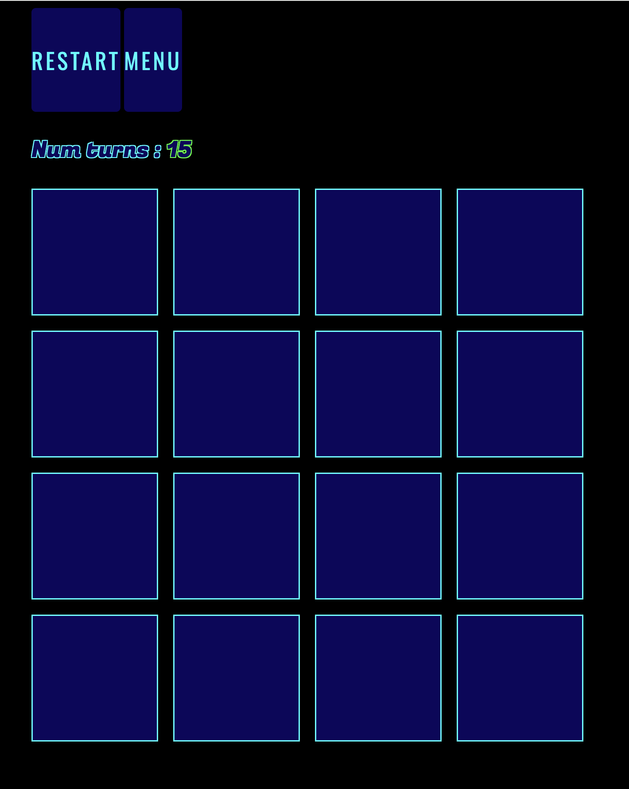

# Memory Match

## [view live project here](https://cassjbeckford.github.io/MemoryMatch/)
## 

## Introduction 

Memory Match is a simple game relying on the users ability to uncover and remember the placement of cards on a gameboard that can be matched together. 
How many tries you have to uncover all the matches depends on the game mode chosen. There are three game modes: easy; where the player has 15 trys to uncover all the matches, hard; in which the player only has 10 trys and impossible; only allowing the player 5 trys.

## Features 

### Menu 

  - The menu consists of three seperate pages that the player can navigate through/around.
  - The menu includes, the front page, how to play section and the difficulty select screen.

  #### Front page: 

  - The front page features the game title alongside two buttons that either lead the the difficulty select or how to play section.
  

  #### How to play: 

  - The how to play section features an explanation on how to play the game as well as outlining all rules/paramters.
  - This page also features a button in the top corner that can send the player back to the menu.
   

  #### difficulty select: 

  - The difficulty select page features three buttons.
  - the first button takes the player to the easy difficulty gameboard.
  - the second button takes the player to the hard difficulty gameboard.
  - the third button takes the player to the impossible difficulty gameboard.
  

### Gamescreen

  - The gamescreen features 2 buttons at the top of the page. One that can reset the gameboard and another that will take the player to the front page.
  - The gamescren features 16 cards that can be turned over.
  
  - The number of turns allowed to the useris also displayed, differing depending on the difficulty.
  
  
  

## User Experience (UX)

-  #### User stories: 

    1. As a user, I dont want to spend loads of time learning how to play.
    2. As a user, I want to be able to reset the game if I want to start again.
    4. As a user, I want the game to look visiually pleasing. 
    5. As a user, I want to be able to play this on different devices. 
    7. As a user, I want access to different game modes depending on how I want to challenge myself.

## Design

#### Colour Scheme

  - The main colours used are black, dark blue and light blue for all sections. Green, Orange and Red are used to indicate easy, medium or hard. 
  - [coolors](https://coolors.co/): Coolors has been used to aid the desision the colour sceme for the project.
  ###  


#### Typography

  -   The main fonts on this site are .

### Wireframes

All wireframes were created using [balsamiq](https://balsamiq.com/)

- Main Page Wireframe - [view](docs/wireframes/front-page-WF.png)

- Difficulty Select Wireframe - [view](docs/wireframes/difficulty-select-WF.png)

- How To Play Wireframe - [view](docs/wireframes/how-to-play-WF.png)

- Gamescreen Wireframe - [view](docs/wireframes/game-screen-WF.png)

### Languages Used

-   [HTML5](https://en.wikipedia.org/wiki/HTML5)
-   [CSS3](https://en.wikipedia.org/wiki/Cascading_Style_Sheets)
-   [Javacript](https://en.wikipedia.org/wiki/JavaScript)

### Frameworks, Libraries & Programs Used

1. [Google Fonts:](https://fonts.google.com/)
    - Google fonts was used for all text across the webpage
2. [Git](https://git-scm.com/)
    - Git was used for version control by utilizing the Gitpod terminal to commit to Git and Push to GitHub.
3. [GitHub:](https://github.com/)
    - GitHub is used to store the projects code after being pushed from Git.

## Testing

### DevTools

Lighthouse results

## 

### Validator Testing 

WC3 Markup Validator and W3C CSS Validator were used to validate the Project.

HTML

## 

CSS

## 

### Further testing 

This website was tested on:

- Google Chrome, Firefox, Microsoft Edge and Safari.
- The website was tested on multiple devices. Laptop, Ipad, Iphone 11 and Iphone 12.
- Testing has been done to ensure all elements were linking correctly. 

### Known bugs 

- Delays with hiding elements when navigating between screens.

### Fixed bugs 

## Development process

- I started the program and repository by using the [gitpod template](https://github.com/Code-Institute-Org/gitpod-full-template) provided by the Code Insitute.  
- Then I regularly staged my changes using the command `git add <filename>` and then committed the staged changes to my local repository using `git commit -m 'short descriptive message here'`. 
- Finally, I would push the commits from my local repository up to the Github repository using the command `git push`.
- With every push, Github automatically deploys my latest commit from the 'main' branch to the Github pages.

## Deployment 

### Github Pages

The project was deployed to GitHub Pages using the following steps...

1. Log in to GitHub and locate the [GitHub Repository](https://github.com/CassJBeckford/MemoryMatch)
2. At the top of the Repository (not top of page), locate the "Settings" Button on the menu.
3. Scroll down the Settings page until you locate the "GitHub Pages" Section.
4. Under "Source", click the dropdown called "None" and select "Main Branch".
5. The page will automatically refresh.
6. Scroll back down through the page to locate the now published site [link](https://github.com/CassJBeckford/MemoryMatch/deployments/activity_log?environment=github-pages) in the "GitHub Pages" section.


### Forking the Github repository

By forking the GitHub Repository we make a copy of the original repository on our GitHub account to view and/or make changes without affecting the original repository by using the following steps...

1. Log in to GitHub and locate the [GitHub Repository](https://github.com/CassJBeckford/MemoryMatch)
2. At the top of the Repository (not top of page) just above the "Settings" Button on the menu, locate the "Fork" Button.
3. You should now have a copy of the original repository in your GitHub account.

### Making a local clone 

1. Log in to GitHub and locate the [GitHub Repository](https://github.com/CassJBeckford/MemoryMatch)
2. Under the repository name, click "Clone or download".
3. To clone the repository using HTTPS, under "Clone with HTTPS", copy the link.
4. Open Git Bash
5. Change the current working directory to the location where you want the cloned directory to be made.
6. Type `git clone`, and then paste the URL you copied in Step 3.

```
$ git clone https://github.com/YOUR-USERNAME/YOUR-REPOSITORY
```

7. Press Enter. Your local clone will be created.

```
$ git clone https://github.com/YOUR-USERNAME/YOUR-REPOSITORY
> Cloning into `CI-Clone`...
> remote: Counting objects: 10, done.
> remote: Compressing objects: 100% (8/8), done.
> remove: Total 10 (delta 1), reused 10 (delta 1)
> Unpacking objects: 100% (10/10), done.
```

Click [Here](https://help.github.com/en/github/creating-cloning-and-archiving-repositories/cloning-a-repository#cloning-a-repository-to-github-desktop) to retrieve pictures for some of the buttons and more detailed explanations of the above process.


Alternatively, if using Gitpod, you can click below to create your own workspace using this repository.

[](https://gitpod.io/#https://github.com/CassJBeckford/MemoryMatch)

## Credits

### Code

- [Favicon.io](https://fontawesome.com/) images were used for the emoji memory cards.
- Creating cards with the flip effect taken from [W3Scool](https://www.w3schools.com/howto/howto_css_flip_card.asp)
- General coding niggles helped by [W3School](https://www.w3schools.com/)
- Guidance for shuffling the cards on my gamescreen taken from [geeksforgeeks](https://www.geeksforgeeks.org/shuffle-a-given-array-using-fisher-yates-shuffle-algorithm/)
- Guidance on how to flip cards using js taken from [Medium](https://jefferson-cuartas.medium.com/how-to-create-a-flip-card-effect-using-javascript-767dd945210c)
- Help with creating the timer from [SheCodes](https://www.shecodes.io/athena/52336-how-to-create-a-countdown-timer-in-javascript)


## Acknowledgments

Special thanks to my Tutor- Miguel & Mentor- Moritz for their help and guidance throughout this project. 
